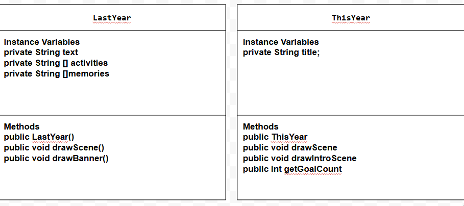

# Project: New Scene, New Me

## Introduction

Software engineers develop programs to create visual and audio experiences using object-oriented programming. As we begin 2026, your goal is to create an animation program that reflects on your experiences from 2025 and visualizes your goals and aspirations for the year ahead using the Theater and Scene API.

## Requirements

Use your knowledge of object-oriented programming, one-dimensional (1D) arrays, algorithms, and the Theater/Scene API to create your animation program:
- **Write Scene subclasses** – Create two Scene subclasses: one to visualize your 2025 recap (LastYear) and another to project your 2026 goals (ThisYear). Each class must include both a no-argument constructor and a parameterized constructor.
- **Use private instance variables** – Implement proper encapsulation by declaring instance variables as private in your Scene subclasses.
- **Create 1D arrays** – Create at least two 1D arrays to store data for your scenes. One array must be created using an initializer list, and one array must be populated by reading from a text file using the FileReader class.
- **Write a method** – Write a method that finds or manipulates the elements in a 1D array to provide the information your user needs.
- **Access and modify array elements** – Use algorithms to traverse, access, and/or modify elements in your 1D arrays to display personalized content in your scenes.
- **Use logic and iteration** – Incorporate selection statements (if/if-else) and loops (while, for, or enhanced for) to control the flow and display of content in your scenes.
Incorporate variety of media – Use at least four different types of Scene API methods across both scenes (examples: drawImage(), drawText(), drawRectangle(), drawEllipse(), playSound(), setTextStyle(), setFillColor(), etc.).
- **Create a UML diagram** – Design a UML class diagram showing your Scene subclasses with their instance variables, constructors, and methods before you begin coding.
- **Document your code** – Use multi-line comments to explain the purpose of each method (including preconditions and postconditions) and single-line comments to explain code segments.

## UML Diagram 

Put an image of your UML Diagram here. Upload the image of your UML Diagram to your repository, then use the Markdown syntax to insert your image here. Make sure your image file name is one work, otherwise it might not properly get displayed on this README. 

 

## Description of 2025 recap

Write a description of what you included in your 2025 recap scene (LastYear)
- In my 2025 recap scene, I showed the activities, memories, and food I explored in the past year. The activities I explored was horse riding in Palm Springs and tubing in Hawaii. The memories I included where hangouts with my friends at a mall and pool party. Finally, the food I included where from the trips I went on in 2025. I included shaved ice from Hawaii and dosa from India! The scene begins with a scrolling banner that displays a recap message across the screen. After the banner, the program displays images representing the activities I expressed from 2025 that are read from a text file and stored in a 1D array. Each image is shown one at a time using a loop and pauses to create an animation effect. The scene then transitions to another set of images representing memories, which are stored in an array created with an initializer list. Loops and timing are used throughout the scene to smoothly display each image and create an engaging recap of the year. 

## Description of 2026 goals

Write a description of what you included in your 2026 goals scene (ThisYear)
- In my 2026 goals scene I included things I aim for in the new year such as getting good grades, spending more family time, and sleeping more. The scene starts with an introduction screen that shows the title and a list of personal goals. Conditional logic is used to display a special message when the number of goals meets a certain condition. The scene then uses a loop to rotate an image, creating a simple animation effect, folloed by additional goal images displayed with pauses. THe scene finally ends wiht a closing screen. 

## Scene API Usage

Describe how you were able to use the various methods from the Scene API to create your animation. 
-  I used a vairety of methods from the Scene API to create animations and visual effects across both scenes. Methods such as drawImage() and drawText() were used to display images and text on the screen, while clear() helped transition between different parts of each scene. Text and styling methods like setTextHeight() and setTextColor() were used to improve visual appeal and for the users to read. The pause() method was also essential because it controlled timing and create a smooth flow. Together these Scene API methods allowed me to experiment with images and text to create my new scene new me project!
